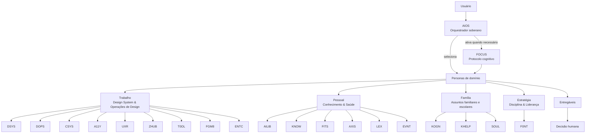

# AIOS Persona Map

**Version:** 2026-05-10

Este mapa representa a separação entre o orquestrador AIOS, o protocolo cognitivo FOCUS e as personas de domínio.

## Core Layers
- `docs/core/AIOS.md` — orquestrador soberano
- `docs/protocols/focus-protocol.md` — protocolo cognitivo
- `docs/personas/` — autoridades de domínio

## Groups (normalized folders)
- `trabalho-design-system-and-operacoes-de-design`
- `pessoal-conhecimento-and-saude`
- `familia-assuntos-familiares-e-escolares`
- `estrategia-disciplina-and-lideranca`
