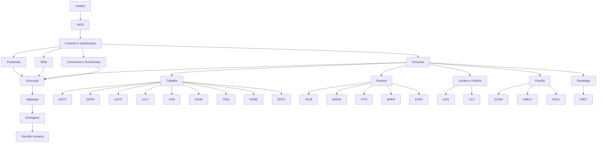

# Mapa do AIOS

**Versão:** 2026-09-07

## Referências centrais

- [Coordenação AIOS](core/AIOS.md)
- [Constituição](constitution/aios-constitution.md)
- [FOCUS](protocols/focus-protocol.md)
- [Skills](skills/README.md)
- [Índice de personas](personas-index.md)
- [Decisões](decisions/README.md)

## Grupos de personas

- [Trabalho](personas/trabalho-design-system-and-operacoes-de-design)
- [Pessoal](personas/pessoal-conhecimento-and-saude)
- [Família](personas/familia-assuntos-familiares-e-escolares)
- [Estratégia](personas/estrategia-disciplina-and-lideranca)
- [Jurídico e Política](personas-index.md#jurídico-e-política)

## Integração de saúde e performance

FITS lidera treino, nutrição e recuperação; BHKR lidera farmacologia e biohacking. AIOS integra perguntas mistas conforme a [decisão FITS–BHKR](decisions/2026-09-06-fits-bhkr.md).

## Execução com skills

AIOS seleciona [aios-maintenance e orchestrate](skills/README.md) conforme a tarefa. FOCUS orienta o raciocínio; orchestrate distribui atribuições. Plano e validação final permanecem no AIOS. Essas capacidades não são personas.
