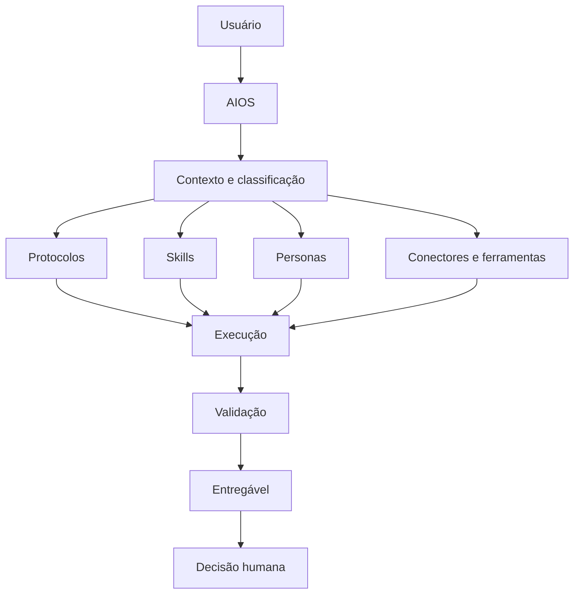

# AIOS System Map

**Version:** 2026-08-31

## Core references

- [AIOS core](core/AIOS.md)
- [Constitution](constitution/aios-constitution.md)
- [FOCUS](protocols/focus-protocol.md)
- [Skills](skills/README.md)
- [Personas index](personas-index.md)
- [Decision records](decisions/README.md)

## Persona groups

- [Trabalho](personas/trabalho-design-system-and-operacoes-de-design)
- [Pessoal](personas/pessoal-conhecimento-and-saude)
- [Família](personas/familia-assuntos-familiares-e-escolares)
- [Estratégia](personas/estrategia-disciplina-and-lideranca)
