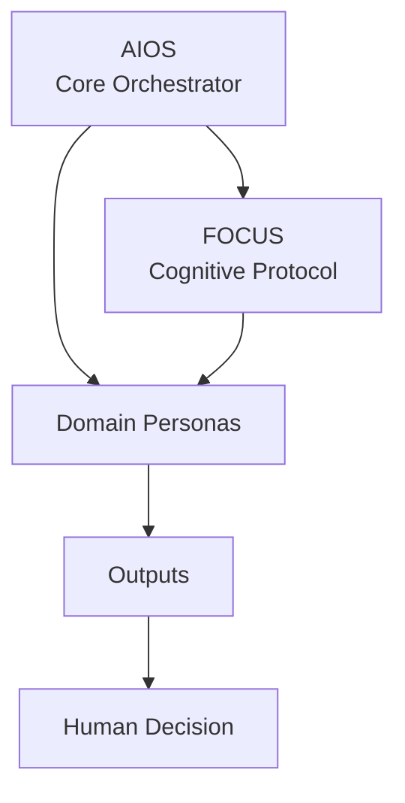

# Core — AIOS

Esta pasta reúne os elementos centrais do **AIOS — AI Operating System**.

## Purpose

Documentar a camada soberana de orquestração do sistema, separando claramente:

- o **orquestrador**;
- os **protocolos cognitivos**;
- as **personas de domínio**;
- a **decisão humana final**.

## Contents

| Arquivo | Função |
|---|---|
| [`AIOS.md`](AIOS.md) | Define o AIOS como orquestrador soberano do ecossistema. |

## Core Principles

- AIOS é orquestrador, não persona de domínio.
- AIOS interpreta intenção, define precedência, ativa protocolos e seleciona personas.
- Nenhuma persona ou protocolo se autoativa sem mediação do AIOS.
- A autoridade intelectual final permanece humana.

## Relationship with Other Layers

## Governance

Qualquer mudança nesta pasta deve ser tratada como alteração estrutural do sistema e registrada no `CHANGELOG.md`.

Mudanças constitucionais devem ser avaliadas contra:

- `docs/constitution/aios-constitution.md`
- `MANIFESTO.md`
- `DOCOPS.md`
